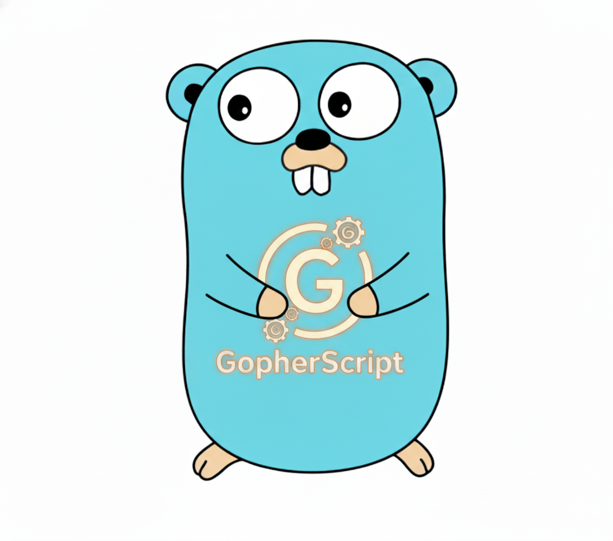

# GopherScript



A CLI tool that converts Python and Shell scripts into Go static binaries.

## Overview

GopherScript leverages LLM (Large Language Model) to convert Python or Shell scripts into idiomatic Go code. The converted code is compiled into a single static binary that can run anywhere without runtime dependencies.

### Supported LLM Providers
- **Google Gemini** (default)
- **OpenAI GPT-4o**
- **Anthropic Claude**

## Installation

### From Releases (Recommended)

Download the latest release for your platform from the [Releases page](https://github.com/bonzonkim/gopher-script/releases).

**Linux/macOS (one-liner):**
```bash
# Linux (amd64)
curl -sL https://github.com/bonzonkim/gopher-script/releases/latest/download/gopherscript_linux_amd64.tar.gz | tar xz
sudo mv gopherscript /usr/local/bin/

# macOS (Apple Silicon)
curl -sL https://github.com/bonzonkim/gopher-script/releases/latest/download/gopherscript_darwin_arm64.tar.gz | tar xz
sudo mv gopherscript /usr/local/bin/

# macOS (Intel)
curl -sL https://github.com/bonzonkim/gopher-script/releases/latest/download/gopherscript_darwin_amd64.tar.gz | tar xz
sudo mv gopherscript /usr/local/bin/
```

**Windows:**
1. Download `gopherscript_windows_amd64.zip` from [Releases](https://github.com/bonzonkim/gopher-script/releases)
2. Extract and add to PATH

### Using Go Install

```bash
go install github.com/bonzonkim/gopher-script@latest
```

### Build from Source

```bash
git clone https://github.com/bonzonkim/gopher-script.git
cd gopher-script
go build -o gopherscript .
```

## Usage

### Basic Usage

```bash
# Convert Python script to Go
gopherscript script.py

# Convert Shell script to Go
gopherscript script.sh

# Specify output path
gopherscript script.py -o output.go

# Convert and build binary
gopherscript script.py --build

# Build with custom binary path
gopherscript script.py --build -b ./bin/myapp
```

### Selecting LLM Provider

```bash
# Use OpenAI GPT
gopherscript script.py --provider openai

# Use Anthropic Claude
gopherscript script.py --provider claude

# Use Google Gemini (default)
gopherscript script.py --provider gemini
```

### Environment Variables

| Variable | Description |
|----------|-------------|
| `LLM_PROVIDER` | Default LLM provider (gemini/openai/claude) |
| `GEMINI_API_KEY` | Google Gemini API key |
| `OPENAI_API_KEY` | OpenAI API key |
| `ANTHROPIC_API_KEY` | Anthropic Claude API key |
| `API_KEY` | (Legacy) Falls back to Gemini API key |

### CLI Flags

| Flag | Short | Description |
|------|-------|-------------|
| `--output` | `-o` | Output path for generated Go file |
| `--binary` | `-b` | Output path for compiled binary (requires --build) |
| `--build` | | Build binary after conversion |
| `--provider` | `-p` | LLM provider to use |
| `--verbose` | `-v` | Enable verbose logging |

## ⚠️ Important Warnings

### 🔐 Sensitive Information Security

> [!CAUTION]
> **Sensitive information in your scripts WILL be sent to LLM servers!**

GopherScript sends script contents to external LLM APIs for conversion. Therefore:

1. **Mask API Keys, Passwords, and Tokens**
   ```bash
   # ❌ Dangerous: Actual API key exposed
   API_KEY="sk-1234567890abcdef"
   
   # ✅ Safe: Use placeholders
   API_KEY="${API_KEY}"  # or API_KEY="YOUR_API_KEY_HERE"
   ```

2. **Database Connection Credentials**
   ```bash
   # ❌ Dangerous
   DB_PASSWORD="mysecretpassword"
   
   # ✅ Safe
   DB_PASSWORD="${DB_PASSWORD}"
   ```

3. **Internal Server Addresses**
   ```bash
   # ❌ Dangerous: Internal infrastructure exposed
   curl http://internal-server.company.com:8080
   
   # ✅ Safe
   curl "${INTERNAL_SERVER_URL}"
   ```

### 📋 Pre-Conversion Checklist

- [ ] Replace hardcoded passwords/API keys with environment variables
- [ ] Parameterize internal IP addresses and domains
- [ ] Verify no PII (Personally Identifiable Information) is present
- [ ] Check for proprietary/confidential information

### 🔍 Automatic Masking (Recommended)

Example script to mask sensitive information before conversion:

```bash
# Mask sensitive data before conversion
sed -e 's/password="[^"]*"/password="${PASSWORD}"/g' \
    -e 's/api_key="[^"]*"/api_key="${API_KEY}"/g' \
    script.py > script_masked.py

# Convert the masked script
gopherscript script_masked.py
```

### ⚡ Other Considerations

1. **Validate LLM Output**: Always review generated Go code. LLM may not perfectly convert the original logic.

2. **Complex Scripts**: Very complex scripts may require multiple attempts.

3. **System Dependencies**: Scripts relying on specific system commands or libraries may need manual modifications.

4. **API Costs**: LLM API calls incur costs. Check pricing for large scripts or frequent conversions.

## Examples

### Converting Python Script

Original (`example.py`):
```python
#!/usr/bin/env python3
import sys

def greet(name):
    return f"Hello, {name}!"

if __name__ == "__main__":
    name = sys.argv[1] if len(sys.argv) > 1 else "World"
    print(greet(name))
```

Convert:
```bash
gopherscript example.py --build
```

### Converting Shell Script

Original (`example.sh`):
```bash
#!/bin/bash
NAME=${1:-"World"}
echo "Hello, $NAME!"
```

Convert:
```bash
gopherscript example.sh -o hello.go --build -b hello
```

## License

MIT License

## Contributing

Issues and pull requests are welcome!
